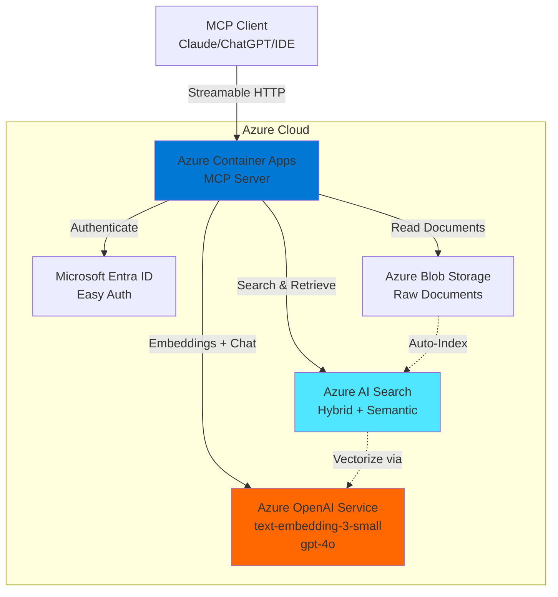
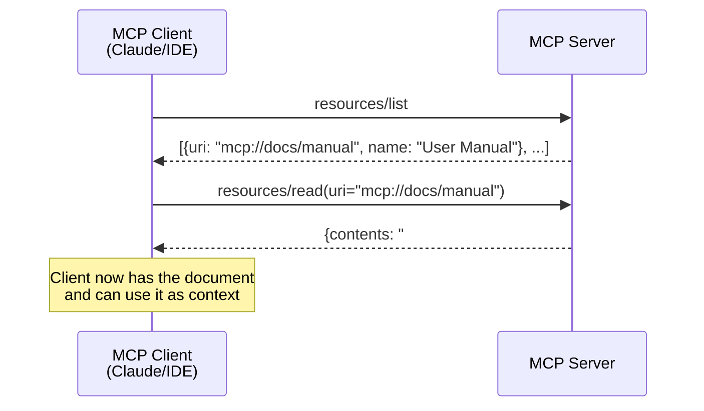
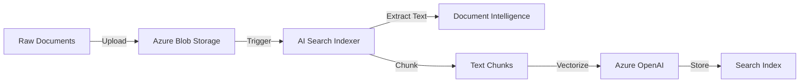
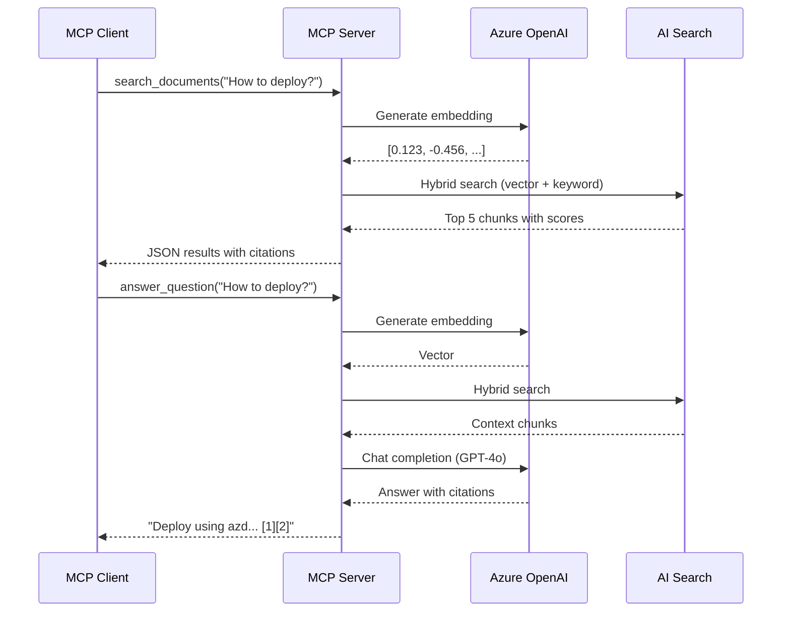

# Azure MCP Retrieval Server - Complete Implementation Plan
**By: GitHub Copilot (Claude Sonnet 4.5)**  
**Date: December 13, 2025**

---

## Executive Summary

This document provides a comprehensive plan to design, implement, and deploy a **Model Context Protocol (MCP) Retrieval Server** on Microsoft Azure. The solution addresses all requirements from the live coding interview: authenticated access, document resources, retrieval/search capabilities, and LLM-accessible tools.

**Key Design Principles:**
- **Azure-Native**: Leverage managed services to minimize operational overhead
- **Security-First**: Use Managed Identity and Entra ID for authentication
- **Cost-Optimized**: Serverless compute with scale-to-zero capabilities
- **RAG-Ready**: Hybrid search with vector embeddings and semantic ranking

---

## ⚠️ IMPORTANT: Transport Protocol Update (March 2025)

**SSE (Server-Sent Events) over HTTP has been DEPRECATED** and replaced by **Streamable HTTP** in the MCP specification as of March 2025.

**Key Changes:**
- ❌ **Old (Deprecated)**: HTTP+SSE with separate endpoints for client→server (POST) and server→client (SSE)
- ✅ **New (Current)**: **Streamable HTTP** with a single `/mcp` endpoint that handles both request/response and streaming
- 🔄 **Advantages**: Simpler architecture, better stateless support, more robust for cloud deployments

**What to Use:**
- **Remote servers (Azure)**: Use **Streamable HTTP**
- **Local servers**: Continue using **STDIO** (unchanged)

---

## PHASE 1: High-Level Architecture & Design Decisions

### 1.1 Architecture Overview



### 1.2 Component Selection & Rationale

| Component | Azure Service | Justification |
|-----------|---------------|---------------|
| **Compute** | Azure Container Apps (Consumption) | • Scale-to-zero for cost savings<br/>• Native HTTP support for MCP Streamable HTTP<br/>• Easy Auth integration<br/>• 2M free requests/month |
| **Authentication** | Managed Identity + Easy Auth | • Passwordless service-to-service auth<br/>• Built-in Entra ID integration<br/>• Optional API key for demos |
| **Vector Database** | Azure AI Search | • Enterprise-grade RAG solution<br/>• Hybrid search (vector + keyword)<br/>• Semantic ranking built-in<br/>• Integrated with AOAI |
| **AI Models** | Azure OpenAI Service | • Enterprise SLA and data residency<br/>• `text-embedding-3-small` (1536 dims)<br/>• `gpt-4o` for chat completions |
| **Document Storage** | Azure Blob Storage | • Cheapest storage ($0.02/GB/month)<br/>• Integrated with AI Search indexers<br/>• Supports SAS tokens for secure access |
| **Infrastructure** | Bicep + Azure Developer CLI | • Declarative IaC<br/>• Reproducible deployments<br/>• `azd` templates for rapid setup |

### 1.3 Core Design Decisions

#### Language & Framework
- **Python 3.11+**: Best Azure SDK support and MCP ecosystem maturity
- **MCP SDK**: `mcp` library (FastMCP with Streamable HTTP transport)
- **Transport**: **Streamable HTTP** (single endpoint, replaces deprecated SSE as of March 2025)

#### Authentication Strategy
**Inbound (Client → Server):**
- **Production**: Azure Container Apps Easy Auth with Entra ID
- **Development**: Bearer token (API key) for simplicity

**Outbound (Server → Azure Services):**
- **DefaultAzureCredential**: Managed Identity in production, Azure CLI in local dev

#### Retrieval Strategy
- **Hybrid Search**: Combines vector similarity (semantic) + keyword matching (BM25)
- **Semantic Ranking**: Azure AI Search's built-in reranking for better precision
- **Chunking**: 512 tokens with 50-token overlap (via Azure AI Search indexer)
- **Citations**: Return `source_url` + `chunk_id` with every result

#### MCP Protocol Surfaces
1. **Resources**: Each document exposed as `mcp://docs/{doc_id}` with metadata
2. **Tools**:
   - `search_documents(query, limit=5)`: Returns ranked chunks with citations
   - `answer_question(question, limit=5)`: RAG-powered Q&A with source attribution
   - `list_documents()`: Enumerate available resources

---

## Understanding MCP Resources vs Tools

### What Are MCP Resources?

**MCP Resources** are **data/content** that your server exposes to clients. Think of them as **read-only data endpoints** that clients can discover and access.

**Key Characteristics:**
- 📄 **Passive data**: Resources don't perform actions; they represent content
- 🔍 **Discoverable**: Clients can list all available resources
- 🔗 **URI-based**: Each resource has a unique URI (e.g., `mcp://docs/file-123`)
- 📋 **Metadata-rich**: Include title, MIME type, size, modification date
- 💾 **Cached**: Clients may cache resource content

### Resources vs Tools: When to Use Which?

| Feature | Resources | Tools |
|---------|-----------|-------|
| **Purpose** | Expose static/semi-static data | Perform actions or computations |
| **Examples** | Documents, files, database records | Search, calculate, transform data |
| **Client Access** | `resources/list`, `resources/read` | `tools/call` |
| **Parameters** | URI only | Arbitrary function parameters |
| **Caching** | Cacheable by clients | Results not typically cached |
| **Updates** | Via notifications when changed | Execute on-demand |

**Rule of Thumb:**
- Use **Resources** for: "Here's data you can read"
- Use **Tools** for: "Here's something you can do"

### Resource URI Schemes

Resources use custom URI schemes to identify content types:

```
mcp://docs/user-manual-2024        → Document
mcp://database/customers/12345     → Database record
file:///path/to/local/file.pdf     → Local file
https://example.com/api/data       → Remote HTTP resource
```

### How Clients Use Resources



### Real-World Example: Document Resources

**Scenario:** Expose 100 PDF documents to Claude Desktop

```python
from mcp.server.fastmcp import FastMCP

mcp = FastMCP("document-server")

# 1. List all available documents (resource discovery)
@mcp.resource("docs://")
async def list_all_documents() -> List[Dict]:
    """
    Called when client wants to discover what's available.
    Returns a list of all document resources.
    """
    docs = search_client.search(
        search_text="*",
        select=["id", "title", "source_url", "last_modified"],
        top=100
    )
    
    return [
        {
            "uri": f"mcp://docs/{doc['id']}",
            "name": doc['title'],
            "mimeType": "text/plain",
            "description": f"Document from {doc['source_url']}"
        }
        for doc in docs
    ]

# 2. Read a specific document (resource access)
@mcp.resource("docs://{doc_id}")
async def get_document(doc_id: str) -> Dict:
    """
    Called when client wants to read a specific document.
    Returns the full content.
    """
    result = search_client.get_document(key=doc_id)
    
    return {
        "uri": f"mcp://docs/{doc_id}",
        "mimeType": "text/plain",
        "contents": result['content'],  # The actual document text
        "metadata": {
            "title": result['title'],
            "source": result['source_url'],
            "modified": result['last_modified']
        }
    }
```

### Claude Desktop User Experience

When you configure this server in Claude Desktop:

**User:** "What documents do you have access to?"

**Claude:** *calls `resources/list`*
"I have access to 100 documents including:
- User Manual v2.1
- API Reference Guide
- Deployment Instructions
- Troubleshooting FAQ
..."

**User:** "Show me the deployment instructions"

**Claude:** *calls `resources/read(uri="mcp://docs/deployment-guide")`*
*Reads the full document content*
"According to the deployment instructions, you need to:
1. Install Azure CLI
2. Run `azd up`
..."

### Advanced Resource Patterns

#### Pattern 1: Dynamic Resources (Database-Backed)

```python
@mcp.resource("customers://{customer_id}")
async def get_customer(customer_id: str):
    """Expose customer records as resources"""
    customer = await db.get_customer(customer_id)
    return {
        "uri": f"mcp://customers/{customer_id}",
        "mimeType": "application/json",
        "contents": json.dumps(customer, indent=2)
    }
```

#### Pattern 2: Hierarchical Resources

```python
@mcp.resource("docs://{category}/{doc_id}")
async def get_document_by_category(category: str, doc_id: str):
    """Organize documents by category"""
    # category = "api-docs", "tutorials", "guides"
    return {...}
```

#### Pattern 3: Resource Templates

```python
@mcp.resource("reports://")
async def list_reports():
    """List available report templates"""
    return [
        {"uri": "mcp://reports/sales-q4", "name": "Q4 Sales Report"},
        {"uri": "mcp://reports/user-analytics", "name": "User Analytics"}
    ]

@mcp.resource("reports://{report_id}")
async def generate_report(report_id: str):
    """Generate report on-demand"""
    data = await generate_report_data(report_id)
    return {
        "uri": f"mcp://reports/{report_id}",
        "mimeType": "text/markdown",
        "contents": format_as_markdown(data)
    }
```

### Resource Updates (Notifications)

When resources change, notify clients:

```python
from mcp.server.models import ResourceUpdated

# After updating a document
await mcp.notify(ResourceUpdated(uri="mcp://docs/user-manual"))
```

Clients can then re-fetch the updated resource.

### Best Practices

✅ **DO:**
- Use descriptive URI schemes that indicate content type
- Include rich metadata (title, description, MIME type)
- Keep individual resources reasonably sized (<10MB)
- Use `resources/list` for discovery
- Implement proper error handling (404 for missing resources)

❌ **DON'T:**
- Use resources for actions (use tools instead)
- Return binary data without proper MIME type
- Forget to handle invalid URIs
- Expose sensitive data without authentication checks

### Resources in Our Azure MCP Server

In our implementation, we use resources to:

1. **Expose document metadata** via `mcp://docs/`
2. **Provide full document access** via `mcp://docs/{doc_id}`
3. **Enable discovery** so Claude knows what documents exist
4. **Support citation** by providing source URLs

**Why This Matters:**
- Claude can **see** what documents are available without searching
- Claude can **read** specific documents to answer questions
- Users can ask "What documents do you have?" and get a real answer
- Provides **context** that persists across conversations

### Complete Example: Using Resources + Tools Together

```python
# Resource: "Here's a document you can read"
@mcp.resource("docs://{doc_id}")
async def get_document(doc_id: str):
    return {"uri": f"mcp://docs/{doc_id}", "contents": "..."}

# Tool: "Here's how to search for relevant documents"
@mcp.tool()
async def search_documents(query: str):
    # Searches and returns URIs that point to resources
    results = perform_search(query)
    return [{"uri": f"mcp://docs/{r.id}", "title": r.title} for r in results]

# Tool: "Here's how to answer a question"
@mcp.tool()
async def answer_question(question: str):
    # Uses search to find relevant resources, then reads them
    relevant_docs = await search_documents(question)
    # Now read those resources and generate answer
    ...
```

**User workflow:**
1. Ask Claude: "What documents do you have?" → Uses `resources/list`
2. Ask Claude: "Search for deployment info" → Uses `search_documents` tool
3. Claude internally reads the returned resource URIs
4. Claude answers using the resource contents as context

---

## PHASE 2: Minimal MCP Server Skeleton

### 2.1 Project Structure

```
azure-mcp-retrieval/
├── src/
│   ├── main.py              # MCP server entry point
│   ├── auth.py              # Authentication logic
│   ├── retrieval.py         # Search & RAG implementation
│   └── config.py            # Configuration management
├── infra/
│   ├── main.bicep           # Main infrastructure template
│   ├── modules/
│   │   ├── container-app.bicep
│   │   ├── search.bicep
│   │   └── openai.bicep
│   └── main.parameters.json
├── Dockerfile
├── azure.yaml               # Azure Developer CLI config
├── requirements.txt
└── README.md
```

### 2.2 Core Implementation (main.py)

```python
"""
Azure MCP Retrieval Server
Provides document search and Q&A capabilities via Model Context Protocol
"""
import os
import asyncio
from typing import List, Dict, Any
from mcp.server.fastmcp import FastMCP
from azure.identity import DefaultAzureCredential
from azure.search.documents import SearchClient
from azure.search.documents.models import VectorizedQuery, QueryType
from openai import AzureOpenAI

# Initialize MCP server
mcp = FastMCP("azure-retrieval-server")

# Azure configuration from environment
AZURE_SEARCH_ENDPOINT = os.environ["AZURE_SEARCH_ENDPOINT"]
AZURE_SEARCH_INDEX = os.environ.get("AZURE_SEARCH_INDEX", "documents")
AZURE_OPENAI_ENDPOINT = os.environ["AZURE_OPENAI_ENDPOINT"]
AZURE_OPENAI_EMBEDDING_DEPLOYMENT = os.environ.get("AZURE_OPENAI_EMBEDDING", "text-embedding-3-small")
AZURE_OPENAI_CHAT_DEPLOYMENT = os.environ.get("AZURE_OPENAI_CHAT", "gpt-4o")
MCP_API_KEY = os.environ.get("MCP_API_KEY")  # Optional for demo/dev

# Initialize Azure clients with Managed Identity
credential = DefaultAzureCredential()
search_client = SearchClient(
    endpoint=AZURE_SEARCH_ENDPOINT,
    index_name=AZURE_SEARCH_INDEX,
    credential=credential
)
openai_client = AzureOpenAI(
    azure_endpoint=AZURE_OPENAI_ENDPOINT,
    api_version="2024-08-01-preview",
    azure_ad_token_provider=lambda: credential.get_token(
        "https://cognitiveservices.azure.com/.default"
    ).token
)

# ==================== Authentication ====================

def verify_auth(headers: Dict[str, str]) -> None:
    """
    Verify client authentication.
    In production, Easy Auth handles this; here we check API key for demos.
    """
    if not MCP_API_KEY:
        return  # No auth required in this mode
    
    auth_header = headers.get("Authorization", "")
    if not auth_header.startswith("Bearer "):
        raise PermissionError("Missing Bearer token")
    
    token = auth_header[7:]
    if token != MCP_API_KEY:
        raise PermissionError("Invalid API key")

# ==================== MCP Resources ====================

@mcp.resource("docs://{doc_id}")
async def get_document(doc_id: str) -> Dict[str, Any]:
    """
    MCP Resource: Retrieve a specific document by ID.
    Returns document metadata and content URL.
    """
    # Query search index for document metadata
    result = search_client.get_document(key=doc_id)
    return {
        "uri": f"docs://{doc_id}",
        "mimeType": "text/plain",
        "metadata": {
            "title": result.get("title"),
            "source_url": result.get("source_url"),
            "last_modified": result.get("last_modified")
        }
    }

@mcp.resource("docs://")
async def list_documents() -> List[Dict[str, Any]]:
    """
    MCP Resource: List all available documents.
    """
    results = search_client.search(
        search_text="*",
        select=["id", "title", "source_url", "last_modified"],
        top=100
    )
    
    docs = []
    for doc in results:
        docs.append({
            "uri": f"docs://{doc['id']}",
            "title": doc.get("title", "Untitled"),
            "source_url": doc.get("source_url"),
            "last_modified": doc.get("last_modified")
        })
    return docs

# ==================== MCP Tools ====================

@mcp.tool()
async def search_documents(query: str, limit: int = 5) -> List[Dict[str, Any]]:
    """
    Search for relevant document chunks using hybrid search.
    
    Args:
        query: The search query string
        limit: Maximum number of results to return (default: 5)
    
    Returns:
        List of document chunks with citations and relevance scores
    """
    # Generate query embedding
    embedding_response = openai_client.embeddings.create(
        input=query,
        model=AZURE_OPENAI_EMBEDDING_DEPLOYMENT
    )
    query_vector = embedding_response.data[0].embedding
    
    # Perform hybrid search (vector + keyword)
    vector_query = VectorizedQuery(
        vector=query_vector,
        k_nearest_neighbors=limit,
        fields="content_vector"
    )
    
    results = search_client.search(
        search_text=query,
        vector_queries=[vector_query],
        query_type=QueryType.SEMANTIC,
        semantic_configuration_name="default",
        top=limit,
        select=["id", "chunk_id", "title", "content", "source_url"]
    )
    
    # Format results
    hits = []
    for result in results:
        hits.append({
            "chunk_id": result.get("chunk_id"),
            "title": result.get("title"),
            "content": result.get("content"),
            "source_url": result.get("source_url"),
            "score": result.get("@search.score"),
            "reranker_score": result.get("@search.reranker_score")
        })
    
    return hits

@mcp.tool()
async def answer_question(question: str, limit: int = 5) -> str:
    """
    Answer a question using RAG (Retrieval-Augmented Generation).
    
    Args:
        question: The question to answer
        limit: Number of context chunks to retrieve (default: 5)
    
    Returns:
        AI-generated answer with citations
    """
    # Retrieve relevant context
    chunks = await search_documents(question, limit)
    
    if not chunks:
        return "I couldn't find relevant information to answer this question."
    
    # Build context with citations
    context_parts = []
    for idx, chunk in enumerate(chunks, 1):
        citation = f"[{idx}]"
        context_parts.append(f"{citation} {chunk['content']}\nSource: {chunk['source_url']}")
    
    context = "\n\n".join(context_parts)
    
    # Generate answer with GPT-4o
    system_prompt = """You are a helpful assistant that answers questions based on provided context.
Always cite your sources using the citation numbers [1], [2], etc. provided in the context.
If the context doesn't contain enough information, say so clearly."""
    
    messages = [
        {"role": "system", "content": system_prompt},
        {"role": "user", "content": f"Context:\n{context}\n\nQuestion: {question}"}
    ]
    
    response = openai_client.chat.completions.create(
        model=AZURE_OPENAI_CHAT_DEPLOYMENT,
        messages=messages,
        temperature=0.3,
        max_tokens=1000
    )
    
    answer = response.choices[0].message.content
    
    # Append source URLs
    sources = "\n\nSources:\n" + "\n".join([
        f"[{idx}] {chunk['title']}: {chunk['source_url']}"
        for idx, chunk in enumerate(chunks, 1)
    ])
    
    return answer + sources

# ==================== Server Entry Point ====================

if __name__ == "__main__":
    # Run the MCP server with Streamable HTTP (March 2025+)
    # Single endpoint at /mcp handles both requests and streaming responses
    mcp.run(transport="streamable-http", host="0.0.0.0", port=8000)
```

### 2.3 Configuration Management (config.py)

```python
"""
Configuration and environment variable management
"""
import os
from dataclasses import dataclass
from azure.identity import DefaultAzureCredential

@dataclass
class AzureConfig:
    """Azure service configuration"""
    search_endpoint: str
    search_index: str
    openai_endpoint: str
    embedding_deployment: str
    chat_deployment: str
    api_key: str | None
    
    @classmethod
    def from_env(cls):
        """Load configuration from environment variables"""
        return cls(
            search_endpoint=os.environ["AZURE_SEARCH_ENDPOINT"],
            search_index=os.environ.get("AZURE_SEARCH_INDEX", "documents"),
            openai_endpoint=os.environ["AZURE_OPENAI_ENDPOINT"],
            embedding_deployment=os.environ.get("AZURE_OPENAI_EMBEDDING", "text-embedding-3-small"),
            chat_deployment=os.environ.get("AZURE_OPENAI_CHAT", "gpt-4o"),
            api_key=os.environ.get("MCP_API_KEY")
        )
```

### 2.4 Dependencies (requirements.txt)

```txt
mcp>=0.9.0
azure-identity>=1.15.0
azure-search-documents>=11.4.0
openai>=1.12.0
uvicorn>=0.27.0
python-dotenv>=1.0.0
```

---

## PHASE 3: Retrieval System Design

### 3.1 Document Ingestion Pipeline

**Goal**: Transform raw documents (PDFs, Word, Markdown) into searchable, vectorized chunks in Azure AI Search.

#### Option 1: Azure AI Search Built-In Indexer (Recommended)

```python
"""
Setup script for Azure AI Search indexer (run once)
"""
from azure.search.documents.indexes import SearchIndexClient
from azure.search.documents.indexes.models import (
    SearchIndex, SimpleField, SearchableField, SearchField,
    VectorSearch, HnswAlgorithmConfiguration, VectorSearchProfile,
    SemanticConfiguration, SemanticField, SemanticPrioritizedFields,
    AzureOpenAIVectorizer, AzureOpenAIParameters
)
from azure.identity import DefaultAzureCredential

credential = DefaultAzureCredential()
index_client = SearchIndexClient(endpoint=SEARCH_ENDPOINT, credential=credential)

# Define the search index schema
fields = [
    SimpleField(name="id", type="Edm.String", key=True),
    SimpleField(name="chunk_id", type="Edm.String", filterable=True),
    SearchableField(name="title", type="Edm.String", searchable=True),
    SearchableField(name="content", type="Edm.String", searchable=True),
    SearchField(
        name="content_vector",
        type="Collection(Edm.Single)",
        searchable=True,
        vector_search_dimensions=1536,
        vector_search_profile_name="openai-profile"
    ),
    SimpleField(name="source_url", type="Edm.String"),
    SimpleField(name="last_modified", type="Edm.DateTimeOffset")
]

# Configure vector search
vector_search = VectorSearch(
    algorithms=[HnswAlgorithmConfiguration(name="hnsw-config")],
    profiles=[VectorSearchProfile(
        name="openai-profile",
        algorithm_configuration_name="hnsw-config",
        vectorizer="openai-vectorizer"
    )],
    vectorizers=[AzureOpenAIVectorizer(
        name="openai-vectorizer",
        azure_open_ai_parameters=AzureOpenAIParameters(
            resource_uri=OPENAI_ENDPOINT,
            deployment_id=EMBEDDING_DEPLOYMENT,
            api_key=None  # Use managed identity
        )
    )]
)

# Configure semantic search
semantic_config = SemanticConfiguration(
    name="default",
    prioritized_fields=SemanticPrioritizedFields(
        title_field=SemanticField(field_name="title"),
        content_fields=[SemanticField(field_name="content")]
    )
)

# Create the index
index = SearchIndex(
    name="documents",
    fields=fields,
    vector_search=vector_search,
    semantic_search=semantic_config
)

index_client.create_or_update_index(index)
print("Index created successfully!")
```

#### Option 2: Custom Ingestion with Python

```python
"""
Custom document processor for more control over chunking
"""
import hashlib
from pathlib import Path
from typing import List, Dict
from azure.storage.blob import BlobServiceClient
from azure.search.documents import SearchClient

class DocumentProcessor:
    def __init__(self, search_client: SearchClient, openai_client: AzureOpenAI):
        self.search = search_client
        self.openai = openai_client
    
    def chunk_text(self, text: str, chunk_size: int = 512, overlap: int = 50) -> List[str]:
        """Split text into overlapping chunks"""
        words = text.split()
        chunks = []
        
        for i in range(0, len(words), chunk_size - overlap):
            chunk = " ".join(words[i:i + chunk_size])
            chunks.append(chunk)
        
        return chunks
    
    def embed_text(self, text: str) -> List[float]:
        """Generate embedding for text"""
        response = self.openai.embeddings.create(
            input=text,
            model=EMBEDDING_DEPLOYMENT
        )
        return response.data[0].embedding
    
    async def ingest_document(self, file_path: Path, title: str, source_url: str):
        """Process and index a document"""
        # Read document (simplified - add PDF/Word parsing as needed)
        text = file_path.read_text(encoding="utf-8")
        
        # Chunk the text
        chunks = self.chunk_text(text)
        
        # Create search documents
        documents = []
        for idx, chunk in enumerate(chunks):
            doc_id = hashlib.md5(f"{file_path.name}_{idx}".encode()).hexdigest()
            
            documents.append({
                "id": doc_id,
                "chunk_id": f"{file_path.stem}_{idx}",
                "title": title,
                "content": chunk,
                "content_vector": self.embed_text(chunk),
                "source_url": source_url,
                "last_modified": file_path.stat().st_mtime
            })
        
        # Upload to Azure AI Search
        self.search.upload_documents(documents)
        print(f"Indexed {len(documents)} chunks from {file_path.name}")

# Usage example
processor = DocumentProcessor(search_client, openai_client)
await processor.ingest_document(
    Path("./docs/sample.md"),
    title="Sample Document",
    source_url="https://example.com/docs/sample.md"
)
```

---

## Running the Document Ingestion Pipeline

### Supported Document Types

Azure AI Search with Document Intelligence can process:

| Document Type | Extension | Notes |
|--------------|-----------|-------|
| **PDF** | `.pdf` | Text extraction + OCR for images |
| **Microsoft Word** | `.docx`, `.doc` | Full text + metadata |
| **Microsoft Excel** | `.xlsx`, `.xls` | Cell data extraction |
| **Microsoft PowerPoint** | `.pptx`, `.ppt` | Slide text + notes |
| **Plain Text** | `.txt`, `.md`, `.log` | Direct ingestion |
| **HTML** | `.html`, `.htm` | Tag stripping |
| **JSON** | `.json` | Structured data |
| **CSV** | `.csv` | Tabular data |
| **Images (OCR)** | `.jpg`, `.png`, `.tiff` | Requires Document Intelligence |

### Ingestion Architecture



---

### **Scenario 1: Automated Ingestion (Azure AI Search Indexer)**

**Best For**: Large document sets, hands-off operation, automatic updates

#### Step 1: Create Blob Storage Data Source

```python
# setup_ingestion.py
from azure.identity import DefaultAzureCredential
from azure.search.documents.indexes import SearchIndexerClient
from azure.search.documents.indexes.models import (
    SearchIndexerDataSourceConnection,
    SearchIndexerDataContainer
)

credential = DefaultAzureCredential()
indexer_client = SearchIndexerClient(
    endpoint="https://your-search.search.windows.net",
    credential=credential
)

# Link to your blob storage
data_source = SearchIndexerDataSourceConnection(
    name="docs-datasource",
    type="azureblob",
    connection_string="DefaultEndpointsProtocol=https;AccountName=youraccount;...",
    container=SearchIndexerDataContainer(name="documents")
)

indexer_client.create_or_update_data_source_connection(data_source)
print("✓ Data source created")
```

#### Step 2: Create Skillset (for chunking and embedding)

```python
from azure.search.documents.indexes.models import (
    SearchIndexerSkillset,
    SplitSkill,
    AzureOpenAIEmbeddingSkill
)

skillset = SearchIndexerSkillset(
    name="docs-skillset",
    skills=[
        # Split documents into chunks
        SplitSkill(
            text_split_mode="pages",
            maximum_page_length=2000,  # ~512 tokens
            page_overlap_length=200,   # ~50 tokens overlap
            inputs=[
                {"name": "text", "source": "/document/content"}
            ],
            outputs=[
                {"name": "textItems", "targetName": "chunks"}
            ]
        ),
        # Generate embeddings for each chunk
        AzureOpenAIEmbeddingSkill(
            resource_uri="https://your-openai.openai.azure.com",
            deployment_id="text-embedding-3-small",
            model_name="text-embedding-3-small",
            inputs=[
                {"name": "text", "source": "/document/chunks/*"}
            ],
            outputs=[
                {"name": "embedding", "targetName": "content_vector"}
            ]
        )
    ]
)

indexer_client.create_or_update_skillset(skillset)
print("✓ Skillset created")
```

#### Step 3: Create Indexer

```python
from azure.search.documents.indexes.models import (
    SearchIndexer,
    FieldMapping,
    OutputFieldMappingEntry
)

indexer = SearchIndexer(
    name="docs-indexer",
    data_source_name="docs-datasource",
    target_index_name="documents",
    skillset_name="docs-skillset",
    parameters={
        "configuration": {
            "dataToExtract": "contentAndMetadata",  # Extract text from PDFs
            "parsingMode": "default",  # Or "json" for JSON files
            "imageAction": "generateNormalizedImages"  # Enable OCR
        }
    },
    field_mappings=[
        FieldMapping(source_field_name="metadata_storage_name", target_field_name="title"),
        FieldMapping(source_field_name="metadata_storage_path", target_field_name="source_url")
    ],
    output_field_mappings=[
        OutputFieldMappingEntry(source_field_name="/document/chunks/*", target_field_name="content"),
        OutputFieldMappingEntry(source_field_name="/document/chunks/*/content_vector", target_field_name="content_vector")
    ],
    schedule={
        "interval": "PT1H"  # Run every hour to catch new docs
    }
)

indexer_client.create_or_update_indexer(indexer)
print("✓ Indexer created and scheduled")
```

#### Step 4: Upload Documents and Run

```bash
# Upload documents to blob storage
az storage blob upload-batch \
  --account-name youraccount \
  --destination documents \
  --source ./local-docs/ \
  --pattern "*.pdf"

# Run the indexer immediately (don't wait for schedule)
az search indexer run \
  --name docs-indexer \
  --service-name your-search \
  --resource-group your-rg

# Check status
az search indexer show \
  --name docs-indexer \
  --service-name your-search \
  --resource-group your-rg \
  --query 'lastResult.status'
```

**Result**: All PDFs automatically processed, chunked, vectorized, and indexed!

---

### **Scenario 2: Custom Python Ingestion (Full Control)**

**Best For**: Custom document formats, specific chunking strategies, one-time imports

#### Complete Ingestion Script

```python
# ingest_documents.py
import os
import hashlib
from pathlib import Path
from typing import List
from azure.identity import DefaultAzureCredential
from azure.search.documents import SearchClient
from openai import AzureOpenAI
from azure.storage.blob import BlobServiceClient
import pypdf
from docx import Document
import json

class MultiFormatDocumentProcessor:
    def __init__(self):
        self.credential = DefaultAzureCredential()
        
        # Azure clients
        self.search_client = SearchClient(
            endpoint=os.environ["AZURE_SEARCH_ENDPOINT"],
            index_name=os.environ["AZURE_SEARCH_INDEX"],
            credential=self.credential
        )
        
        self.openai_client = AzureOpenAI(
            azure_endpoint=os.environ["AZURE_OPENAI_ENDPOINT"],
            api_version="2024-08-01-preview",
            azure_ad_token_provider=lambda: self.credential.get_token(
                "https://cognitiveservices.azure.com/.default"
            ).token
        )
        
        self.blob_client = BlobServiceClient(
            account_url=os.environ["AZURE_STORAGE_ACCOUNT_URL"],
            credential=self.credential
        )
    
    def extract_text(self, file_path: Path) -> str:
        """Extract text from various document formats"""
        suffix = file_path.suffix.lower()
        
        if suffix == '.pdf':
            return self._extract_pdf(file_path)
        elif suffix == '.docx':
            return self._extract_docx(file_path)
        elif suffix in ['.txt', '.md', '.log']:
            return file_path.read_text(encoding='utf-8')
        elif suffix == '.json':
            return json.dumps(json.loads(file_path.read_text()), indent=2)
        else:
            raise ValueError(f"Unsupported format: {suffix}")
    
    def _extract_pdf(self, file_path: Path) -> str:
        """Extract text from PDF"""
        with open(file_path, 'rb') as f:
            pdf = pypdf.PdfReader(f)
            text = []
            for page in pdf.pages:
                text.append(page.extract_text())
            return "\n\n".join(text)
    
    def _extract_docx(self, file_path: Path) -> str:
        """Extract text from Word document"""
        doc = Document(file_path)
        return "\n\n".join([para.text for para in doc.paragraphs if para.text.strip()])
    
    def chunk_text(self, text: str, chunk_size: int = 512, overlap: int = 50) -> List[str]:
        """Split text into overlapping chunks (word-based)"""
        words = text.split()
        chunks = []
        
        for i in range(0, len(words), chunk_size - overlap):
            chunk = " ".join(words[i:i + chunk_size])
            if chunk.strip():
                chunks.append(chunk)
        
        return chunks
    
    def embed_text(self, text: str) -> List[float]:
        """Generate embedding vector"""
        response = self.openai_client.embeddings.create(
            input=text,
            model=os.environ.get("AZURE_OPENAI_EMBEDDING", "text-embedding-3-small")
        )
        return response.data[0].embedding
    
    def upload_to_blob(self, file_path: Path, container: str = "documents") -> str:
        """Upload document to blob storage and return URL"""
        container_client = self.blob_client.get_container_client(container)
        
        # Create container if it doesn't exist
        try:
            container_client.create_container()
        except:
            pass  # Already exists
        
        blob_name = f"raw/{file_path.name}"
        blob_client = container_client.get_blob_client(blob_name)
        
        with open(file_path, 'rb') as data:
            blob_client.upload_blob(data, overwrite=True)
        
        return blob_client.url
    
    async def ingest_document(self, file_path: Path, title: str = None):
        """Process and index a document"""
        print(f"📄 Processing: {file_path.name}")
        
        # 1. Extract text
        try:
            text = self.extract_text(file_path)
            print(f"  ✓ Extracted {len(text)} characters")
        except Exception as e:
            print(f"  ✗ Extraction failed: {e}")
            return
        
        # 2. Upload to blob storage
        try:
            source_url = self.upload_to_blob(file_path)
            print(f"  ✓ Uploaded to blob storage")
        except Exception as e:
            print(f"  ⚠ Upload failed: {e}")
            source_url = f"local://{file_path.name}"
        
        # 3. Chunk text
        chunks = self.chunk_text(text)
        print(f"  ✓ Created {len(chunks)} chunks")
        
        # 4. Create search documents
        documents = []
        for idx, chunk in enumerate(chunks):
            doc_id = hashlib.md5(f"{file_path.name}_{idx}".encode()).hexdigest()
            
            # Generate embedding
            embedding = self.embed_text(chunk)
            
            documents.append({
                "id": doc_id,
                "chunk_id": f"{file_path.stem}_chunk_{idx}",
                "title": title or file_path.stem,
                "content": chunk,
                "content_vector": embedding,
                "source_url": source_url,
                "last_modified": file_path.stat().st_mtime
            })
        
        # 5. Upload to search index
        result = self.search_client.upload_documents(documents)
        success_count = sum(1 for r in result if r.succeeded)
        print(f"  ✓ Indexed {success_count}/{len(documents)} chunks")
        
        return success_count

# ==================== Usage Examples ====================

async def main():
    processor = MultiFormatDocumentProcessor()
    
    # Example 1: Single document
    await processor.ingest_document(
        Path("./docs/user-manual.pdf"),
        title="User Manual v2.1"
    )
    
    # Example 2: Batch processing
    docs_dir = Path("./docs")
    for file in docs_dir.glob("**/*"):
        if file.is_file() and file.suffix in ['.pdf', '.docx', '.md', '.txt']:
            await processor.ingest_document(file)
    
    print("\n✅ Ingestion complete!")

if __name__ == "__main__":
    import asyncio
    asyncio.run(main())
```

#### Running the Script

```bash
# 1. Install dependencies
pip install pypdf python-docx azure-search-documents azure-identity openai azure-storage-blob

# 2. Set environment variables
export AZURE_SEARCH_ENDPOINT="https://your-search.search.windows.net"
export AZURE_SEARCH_INDEX="documents"
export AZURE_OPENAI_ENDPOINT="https://your-openai.openai.azure.com"
export AZURE_STORAGE_ACCOUNT_URL="https://youraccount.blob.core.windows.net"

# 3. Run ingestion
python ingest_documents.py
```

---

### **Scenario 3: On-Demand API Endpoint (Real-Time Ingestion)**

**Best For**: User-uploaded documents, dynamic content, admin panel

```python
# Add to main.py
from fastapi import FastAPI, UploadFile, File, HTTPException
import tempfile

app = FastAPI()

@app.post("/admin/ingest")
async def ingest_upload(
    file: UploadFile = File(...),
    title: str = None,
    api_key: str = Header(None)
):
    """
    Admin endpoint to upload and ingest documents on-demand.
    
    curl -X POST https://your-app.azurecontainerapps.io/admin/ingest \
      -H "Authorization: Bearer ADMIN_KEY" \
      -F "file=@document.pdf" \
      -F "title=Q4 Report"
    """
    # Verify admin API key
    if api_key != os.environ.get("ADMIN_API_KEY"):
        raise HTTPException(status_code=401, detail="Unauthorized")
    
    # Save uploaded file temporarily
    with tempfile.NamedTemporaryFile(delete=False, suffix=Path(file.filename).suffix) as tmp:
        content = await file.read()
        tmp.write(content)
        tmp_path = Path(tmp.name)
    
    try:
        # Process using the same processor
        processor = MultiFormatDocumentProcessor()
        chunk_count = await processor.ingest_document(tmp_path, title or file.filename)
        
        return {
            "status": "success",
            "filename": file.filename,
            "chunks_indexed": chunk_count
        }
    finally:
        tmp_path.unlink()  # Clean up temp file
```

---

### **Scenario 4: Watch Folder (Continuous Ingestion)**

**Best For**: Development, local testing, automatic processing

```python
# watch_ingest.py
import time
from watchdog.observers import Observer
from watchdog.events import FileSystemEventHandler

class DocumentWatcher(FileSystemEventHandler):
    def __init__(self, processor):
        self.processor = processor
    
    def on_created(self, event):
        if event.is_directory:
            return
        
        file_path = Path(event.src_path)
        if file_path.suffix in ['.pdf', '.docx', '.md', '.txt']:
            print(f"🔍 New file detected: {file_path.name}")
            import asyncio
            asyncio.run(self.processor.ingest_document(file_path))

# Usage
processor = MultiFormatDocumentProcessor()
event_handler = DocumentWatcher(processor)
observer = Observer()
observer.schedule(event_handler, path="./docs", recursive=True)
observer.start()

print("👀 Watching ./docs for new documents...")
try:
    while True:
        time.sleep(1)
except KeyboardInterrupt:
    observer.stop()
observer.join()
```

---

### Performance & Best Practices

| Consideration | Recommendation |
|--------------|----------------|
| **Batch Size** | Process 100-1000 docs at a time for optimal throughput |
| **Chunk Size** | 512 tokens (~2000 chars) with 50-100 token overlap |
| **Rate Limits** | Azure OpenAI: 120K TPM (tokens per minute) on embeddings |
| **Indexing Speed** | ~10-50 docs/sec depending on size and processing |
| **Cost** | ~$0.02 per 1M tokens for embeddings (text-embedding-3-small) |
| **Error Handling** | Retry failed documents with exponential backoff |

### Monitoring Ingestion

```python
# Check index statistics
from azure.search.documents.indexes import SearchIndexClient

index_client = SearchIndexClient(endpoint=SEARCH_ENDPOINT, credential=credential)
stats = index_client.get_index_statistics("documents")

print(f"Documents indexed: {stats.document_count}")
print(f"Storage size: {stats.storage_size / 1024 / 1024:.2f} MB")
```

---

### 3.2 Retrieval Flow Diagram



### 3.3 Citation Strategy

Every search result includes:
- `chunk_id`: Unique identifier for the passage
- `source_url`: Link to original document
- `title`: Document name
- `score`: Relevance score

When generating answers, the system:
1. Numbers each chunk [1], [2], [3]...
2. Instructs GPT-4o to use these numbers in the answer
3. Appends source list at the end

---

## PHASE 4: Deployment Strategy

### 4.1 Infrastructure as Code (Bicep)

**Main Template (infra/main.bicep)**:

```bicep
targetScope = 'subscription'

@minLength(1)
@maxLength(64)
@description('Name of the environment (e.g., dev, prod)')
param environmentName string

@minLength(1)
@description('Primary location for all resources')
param location string

@description('Id of the user or app to assign application roles')
param principalId string = ''

// Organize resources in a resource group
resource rg 'Microsoft.Resources/resourceGroups@2021-04-01' = {
  name: 'rg-${environmentName}'
  location: location
}

// Deploy infrastructure
module resources './resources.bicep' = {
  name: 'resources'
  scope: rg
  params: {
    environmentName: environmentName
    location: location
    principalId: principalId
  }
}

// Outputs
output AZURE_CONTAINER_REGISTRY_ENDPOINT string = resources.outputs.REGISTRY_ENDPOINT
output AZURE_CONTAINER_APP_ENDPOINT string = resources.outputs.CONTAINER_APP_ENDPOINT
output AZURE_SEARCH_ENDPOINT string = resources.outputs.SEARCH_ENDPOINT
output AZURE_OPENAI_ENDPOINT string = resources.outputs.OPENAI_ENDPOINT
```

**Resources Module (infra/resources.bicep)**:

```bicep
param environmentName string
param location string
param principalId string

// Container Registry
resource acr 'Microsoft.ContainerRegistry/registries@2023-01-01-preview' = {
  name: 'cr${uniqueString(resourceGroup().id)}'
  location: location
  sku: {
    name: 'Basic'
  }
  properties: {
    adminUserEnabled: true
  }
}

// Container Apps Environment
resource env 'Microsoft.App/managedEnvironments@2023-05-01' = {
  name: 'env-${environmentName}'
  location: location
  properties: {
    workloadProfiles: [
      {
        name: 'Consumption'
        workloadProfileType: 'Consumption'
      }
    ]
  }
}

// Azure AI Search
resource search 'Microsoft.Search/searchServices@2023-11-01' = {
  name: 'search-${uniqueString(resourceGroup().id)}'
  location: location
  sku: {
    name: 'basic'  // Use 'free' for dev
  }
  properties: {
    replicaCount: 1
    partitionCount: 1
  }
}

// Azure OpenAI
resource openai 'Microsoft.CognitiveServices/accounts@2023-05-01' = {
  name: 'openai-${uniqueString(resourceGroup().id)}'
  location: location
  kind: 'OpenAI'
  sku: {
    name: 'S0'
  }
  properties: {
    customSubDomainName: 'openai-${uniqueString(resourceGroup().id)}'
  }
}

// Embeddings deployment
resource embeddingDeployment 'Microsoft.CognitiveServices/accounts/deployments@2023-05-01' = {
  parent: openai
  name: 'text-embedding-3-small'
  sku: {
    name: 'Standard'
    capacity: 120
  }
  properties: {
    model: {
      format: 'OpenAI'
      name: 'text-embedding-3-small'
      version: '1'
    }
  }
}

// Chat deployment
resource chatDeployment 'Microsoft.CognitiveServices/accounts/deployments@2023-05-01' = {
  parent: openai
  name: 'gpt-4o'
  sku: {
    name: 'Standard'
    capacity: 30
  }
  properties: {
    model: {
      format: 'OpenAI'
      name: 'gpt-4o'
      version: '2024-08-06'
    }
  }
  dependsOn: [embeddingDeployment]
}

// Container App
resource app 'Microsoft.App/containerApps@2023-05-01' = {
  name: 'app-${environmentName}'
  location: location
  identity: {
    type: 'SystemAssigned'
  }
  properties: {
    managedEnvironmentId: env.id
    workloadProfileName: 'Consumption'
    configuration: {
      ingress: {
        external: true
        targetPort: 8000
        allowInsecure: false
      }
    }
    template: {
      containers: [
        {
          name: 'mcp-server'
          image: '${acr.properties.loginServer}/mcp-server:latest'
          resources: {
            cpu: json('0.25')
            memory: '0.5Gi'
          }
          env: [
            {
              name: 'AZURE_SEARCH_ENDPOINT'
              value: 'https://${search.name}.search.windows.net'
            }
            {
              name: 'AZURE_SEARCH_INDEX'
              value: 'documents'
            }
            {
              name: 'AZURE_OPENAI_ENDPOINT'
              value: openai.properties.endpoint
            }
            {
              name: 'AZURE_OPENAI_EMBEDDING'
              value: 'text-embedding-3-small'
            }
            {
              name: 'AZURE_OPENAI_CHAT'
              value: 'gpt-4o'
            }
          ]
        }
      ]
      scale: {
        minReplicas: 0  // Scale to zero
        maxReplicas: 10
      }
    }
  }
}

// Role assignments for Managed Identity
resource searchContributor 'Microsoft.Authorization/roleAssignments@2022-04-01' = {
  name: guid(search.id, app.id, 'Search Index Data Contributor')
  scope: search
  properties: {
    principalId: app.identity.principalId
    roleDefinitionId: subscriptionResourceId('Microsoft.Authorization/roleDefinitions', '8ebe5a00-799e-43f5-93ac-243d3dce84a7')
    principalType: 'ServicePrincipal'
  }
}

resource openaiUser 'Microsoft.Authorization/roleAssignments@2022-04-01' = {
  name: guid(openai.id, app.id, 'Cognitive Services OpenAI User')
  scope: openai
  properties: {
    principalId: app.identity.principalId
    roleDefinitionId: subscriptionResourceId('Microsoft.Authorization/roleDefinitions', '5e0bd9bd-7b93-4f28-af87-19fc36ad61bd')
    principalType: 'ServicePrincipal'
  }
}

// Outputs
output REGISTRY_ENDPOINT string = acr.properties.loginServer
output CONTAINER_APP_ENDPOINT string = 'https://${app.properties.configuration.ingress.fqdn}'
output SEARCH_ENDPOINT string = 'https://${search.name}.search.windows.net'
output OPENAI_ENDPOINT string = openai.properties.endpoint
```

### 4.2 Azure Developer CLI Configuration (azure.yaml)

```yaml
name: azure-mcp-retrieval
metadata:
  template: azure-mcp-retrieval@0.0.1
services:
  mcp-server:
    project: ./src
    language: python
    host: containerapp
    docker:
      path: ./Dockerfile
```

### 4.3 Dockerfile

```dockerfile
FROM python:3.11-slim

WORKDIR /app

# Install system dependencies
RUN apt-get update && apt-get install -y \
    curl \
    && rm -rf /var/lib/apt/lists/*

# Copy requirements and install Python dependencies
COPY requirements.txt .
RUN pip install --no-cache-dir -r requirements.txt

# Copy application code
COPY src/ .

# Expose port
EXPOSE 8000

# Health check
HEALTHCHECK --interval=30s --timeout=3s --start-period=5s --retries=3 \
    CMD curl -f http://localhost:8000/health || exit 1

# Run the server
CMD ["python", "main.py"]
```

### 4.4 Deployment Instructions

#### Initial Setup (One-Time)

```bash
# 1. Install Azure Developer CLI
curl -fsSL https://aka.ms/install-azd.sh | bash

# 2. Login to Azure
azd auth login

# 3. Initialize the project
azd init --template azure-mcp-retrieval

# 4. Provision infrastructure
azd up
# This will:
# - Create resource group
# - Deploy all Azure resources
# - Build and push Docker image
# - Deploy to Container Apps

# 5. Get connection details
azd env get-values
```

#### Continuous Deployment

```bash
# Deploy code changes
azd deploy

# Or deploy infrastructure + code
azd up
```

#### Local Development

```bash
# 1. Create virtual environment
python -m venv .venv
source .venv/bin/activate  # Windows: .venv\Scripts\activate

# 2. Install dependencies
pip install -r requirements.txt

# 3. Configure environment variables
cp .env.example .env
# Edit .env with your Azure endpoints

# 4. Run locally
python src/main.py
```

**Environment Variables (.env.example)**:

```bash
# Azure AI Search
AZURE_SEARCH_ENDPOINT=https://your-search.search.windows.net
AZURE_SEARCH_INDEX=documents

# Azure OpenAI
AZURE_OPENAI_ENDPOINT=https://your-openai.openai.azure.com
AZURE_OPENAI_EMBEDDING=text-embedding-3-small
AZURE_OPENAI_CHAT=gpt-4o

# Authentication (optional for local dev)
MCP_API_KEY=your-secret-key-here
```

### 4.5 Connecting MCP Clients

> **⚠️ Note**: Use the new Streamable HTTP transport (March 2025+), not deprecated SSE

#### Claude Desktop Configuration

Edit `~/Library/Application Support/Claude/claude_desktop_config.json`:

```json
{
  "mcpServers": {
    "azure-retrieval": {
      "url": "https://app-yourenv.azurecontainerapps.io/mcp",
      "transport": "streamable-http",
      "headers": {
        "Authorization": "Bearer YOUR_API_KEY"
      }
    }
  }
}
```

#### VS Code / Cursor Configuration

```json
{
  "mcp.servers": [
    {
      "name": "Azure Retrieval",
      "url": "https://app-yourenv.azurecontainerapps.io/mcp",
      "transport": "streamable-http",
      "headers": {
        "Authorization": "Bearer YOUR_API_KEY"
      }
    }
  ]
}
```

---

## Understanding Streamable HTTP Transport (March 2025 Update)

### What Changed?

**Deprecated (Pre-March 2025):** HTTP + SSE (Server-Sent Events)
- Required **two separate endpoints**:
  - HTTP POST endpoint for client → server messages
  - SSE endpoint for server → client streaming
- Complex connection management
- State synchronization issues

**Current Standard:** Streamable HTTP
- **Single endpoint** (typically `/mcp`)
- Accepts standard HTTP POST requests
- Server can respond with:
  - Immediate JSON response (for simple requests)
  - Or upgrade to event stream (for long-running operations)
- Better support for stateless architectures

### How Streamable HTTP Works

```
┌──────────────┐                          ┌────────────────────┐
│ MCP Client   │──HTTP POST /mcp────────▶ │ MCP Server         │
│              │  JSON-RPC 2.0 request    │                    │
│              │                          │                    │
│              │◀─────────────────────────│                    │
│              │  Response (immediate or  │                    │
│              │  streamed if needed)     │                    │
└──────────────┘                          └────────────────────┘
```

### Request Format

```http
POST /mcp HTTP/1.1
Host: your-server.azurecontainerapps.io
Authorization: Bearer YOUR_TOKEN
Content-Type: application/json

{
  "jsonrpc": "2.0",
  "method": "tools/call",
  "params": {
    "name": "search_documents",
    "arguments": {"query": "authentication", "limit": 5}
  },
  "id": 1
}
```

### Response Options

**Option 1: Immediate Response** (for quick operations)
```http
HTTP/1.1 200 OK
Content-Type: application/json

{
  "jsonrpc": "2.0",
  "result": [...],
  "id": 1
}
```

**Option 2: Streaming Response** (for long operations with progress updates)
```http
HTTP/1.1 200 OK
Content-Type: text/event-stream
Transfer-Encoding: chunked

data: {"jsonrpc":"2.0","method":"notifications/progress","params":{"progress":0.3}}

data: {"jsonrpc":"2.0","result":[...],"id":1}
```

### Implementation in FastMCP

```python
from mcp.server.fastmcp import FastMCP

mcp = FastMCP("azure-retrieval-server")

@mcp.tool()
async def search_documents(query: str, limit: int = 5):
    # FastMCP automatically handles streaming vs immediate response
    # based on operation duration
    return results

if __name__ == "__main__":
    # Single line change from deprecated SSE
    mcp.run(
        transport="streamable-http",  # New transport
        host="0.0.0.0",
        port=8000
    )
```

### Why This Matters for Azure Deployment

✅ **Simpler Architecture**
- One endpoint to secure, monitor, and load-balance
- No need to coordinate multiple connections

✅ **Better Cloud-Native**
- Works seamlessly with Azure Container Apps ingress
- Standard HTTP(S) traffic - no special handling

✅ **Improved Reliability**
- Automatic reconnection handled by single connection
- Better proxy and CDN compatibility

✅ **Easier Authentication**
- Single token in header (not split across connections)
- Works with Easy Auth without modifications

### Migration Guide (if using old SSE)

**Old Code (Deprecated):**
```python
mcp.run(transport="sse", host="0.0.0.0", port=8000)
```

**New Code (Current):**
```python
mcp.run(transport="streamable-http", host="0.0.0.0", port=8000)
```

**Old Client Config:**
```json
{
  "command": "curl",
  "args": ["-N", "-H", "Authorization: Bearer KEY", "https://server.io/sse"]
}
```

**New Client Config:**
```json
{
  "url": "https://server.io/mcp",
  "transport": "streamable-http",
  "headers": {"Authorization": "Bearer KEY"}
}
```

---

## Cost Analysis

### Consumption-Based Pricing (Estimated Monthly)

| Service | Configuration | Cost |
|---------|--------------|------|
| **Container Apps** | Consumption (2M requests free) | $0 - $20 |
| **Azure AI Search** | Basic tier (50 MB storage) | $75 |
| **Azure OpenAI** | Pay-per-token:<br/>- Embeddings: $0.02/1M tokens<br/>- GPT-4o: $2.50/1M input | $10 - $100 |
| **Blob Storage** | Standard LRS (1 GB) | $0.02 |
| **Container Registry** | Basic (10 GB) | $5 |
| **Total (Low Volume)** | | **~$90/month** |

### Cost Optimization Strategies

1. **Use Azure AI Search Free Tier** (3 indexes, 50 MB): **$0**
2. **Scale Container Apps to Zero**: Only pay when serving requests
3. **Optimize Token Usage**: Cache embeddings, limit context window
4. **Use Cheaper Models**: Switch to GPT-4o-mini for non-critical workloads

---

## Testing & Validation

### Test Plan

```python
"""
Integration tests for MCP server
"""
import pytest
from mcp.client import ClientSession
import asyncio

@pytest.mark.asyncio
async def test_search_documents():
    async with ClientSession("https://your-app.azurecontainerapps.io") as session:
        result = await session.call_tool("search_documents", {
            "query": "authentication methods",
            "limit": 3
        })
        
        assert len(result) <= 3
        assert all("chunk_id" in hit for hit in result)
        assert all("score" in hit for hit in result)

@pytest.mark.asyncio
async def test_answer_question():
    async with ClientSession("https://your-app.azurecontainerapps.io") as session:
        answer = await session.call_tool("answer_question", {
            "question": "How do I authenticate?"
        })
        
        assert isinstance(answer, str)
        assert len(answer) > 0
        assert "[1]" in answer  # Check for citations

@pytest.mark.asyncio
async def test_list_resources():
    async with ClientSession("https://your-app.azurecontainerapps.io") as session:
        resources = await session.list_resources()
        
        assert isinstance(resources, list)
        assert all("uri" in res for res in resources)
```

---

## Monitoring & Operations

### Application Insights Integration

Add to `main.py`:

```python
from azure.monitor.opentelemetry import configure_azure_monitor
from opentelemetry import trace

# Configure monitoring
configure_azure_monitor(
    connection_string=os.environ.get("APPLICATIONINSIGHTS_CONNECTION_STRING")
)
tracer = trace.get_tracer(__name__)

@mcp.tool()
async def search_documents(query: str, limit: int = 5):
    with tracer.start_as_current_span("search_documents"):
        # Existing implementation
        pass
```

### Key Metrics to Monitor

- **Request Count**: Track usage patterns
- **Latency**: P50, P95, P99 for search/answer operations
- **Error Rate**: Authentication failures, Azure SDK errors
- **Cost**: OpenAI token usage, search query units
- **Scale Events**: Container app scale-up/down

---

## References & Documentation

### Official Azure Documentation
- [Azure Container Apps](https://learn.microsoft.com/azure/container-apps/overview)
- [Azure AI Search - RAG](https://learn.microsoft.com/azure/search/retrieval-augmented-generation-overview)
- [Azure OpenAI Service](https://learn.microsoft.com/azure/ai-services/openai/overview)
- [Managed Identity](https://learn.microsoft.com/entra/identity/managed-identities-azure-resources/overview)

### Azure SDK References
- [azure-search-documents (Python)](https://learn.microsoft.com/python/api/overview/azure/search-documents-readme)
- [azure-identity (Python)](https://learn.microsoft.com/python/api/overview/azure/identity-readme)
- [openai (Python)](https://github.com/openai/openai-python)

### MCP Protocol
- [Model Context Protocol Specification](https://modelcontextprotocol.io/introduction)
- [MCP Python SDK](https://github.com/modelcontextprotocol/python-sdk)

### Sample Repositories
- [Azure Search OpenAI Demo](https://github.com/Azure-Samples/azure-search-openai-demo)
- [Azure Container Apps Samples](https://github.com/Azure-Samples/container-apps-samples)

---

## Conclusion

This plan provides a complete, production-ready architecture for an MCP retrieval server on Azure using the **latest Streamable HTTP transport (March 2025 standard)**. Key strengths:

✅ **Modern Protocol**: Uses current Streamable HTTP (SSE deprecated)  
✅ **Fully Managed**: No servers to maintain  
✅ **Secure**: Managed Identity eliminates secrets  
✅ **Scalable**: Auto-scales from 0 to handle traffic  
✅ **Cost-Efficient**: Pay only for what you use  
✅ **Enterprise-Ready**: Built on Azure's enterprise SLA  

The implementation follows Azure best practices, official MCP specification (2025), and Azure documentation, ensuring maintainability and long-term support.

### Key Takeaways
- ⚠️ **SSE is deprecated** - Use Streamable HTTP for remote servers
- ✅ **STDIO still preferred** for local integrations (Claude Desktop, IDEs)
- 🔄 **Single endpoint** (`/mcp`) simplifies architecture
- 🚀 **Azure Container Apps** perfect for this new transport model

---

**Generated by GitHub Copilot (Claude Sonnet 4.5)**  
**December 13, 2025**
