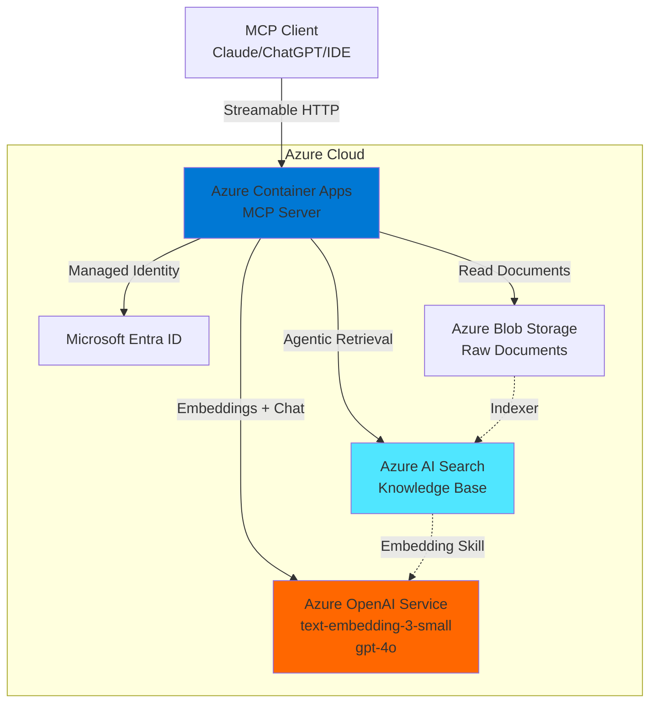
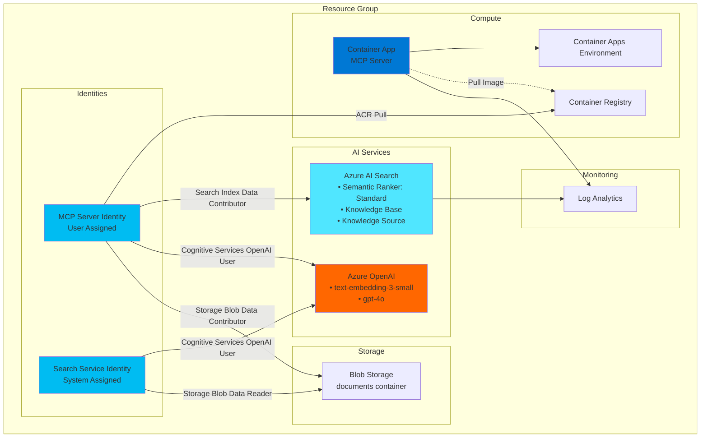
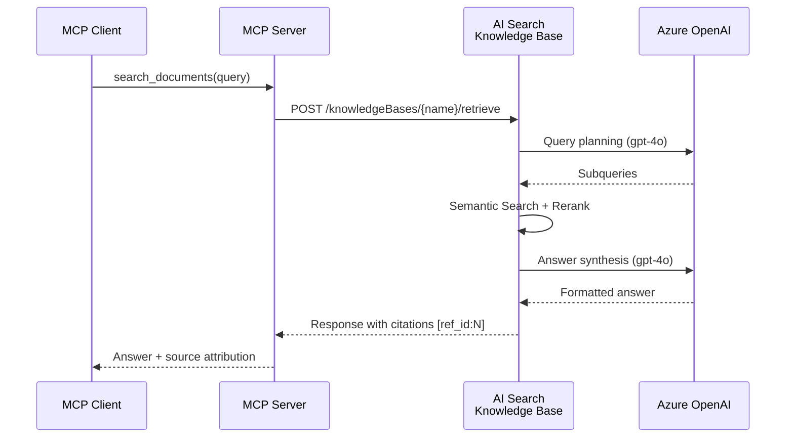
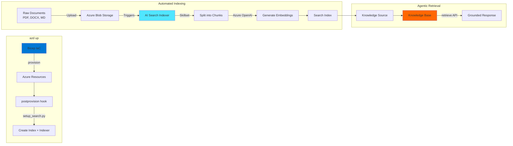
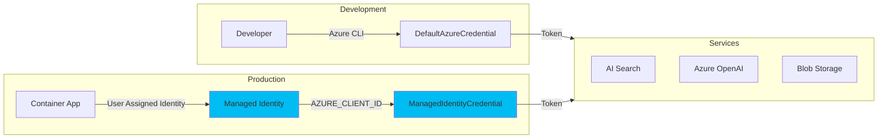
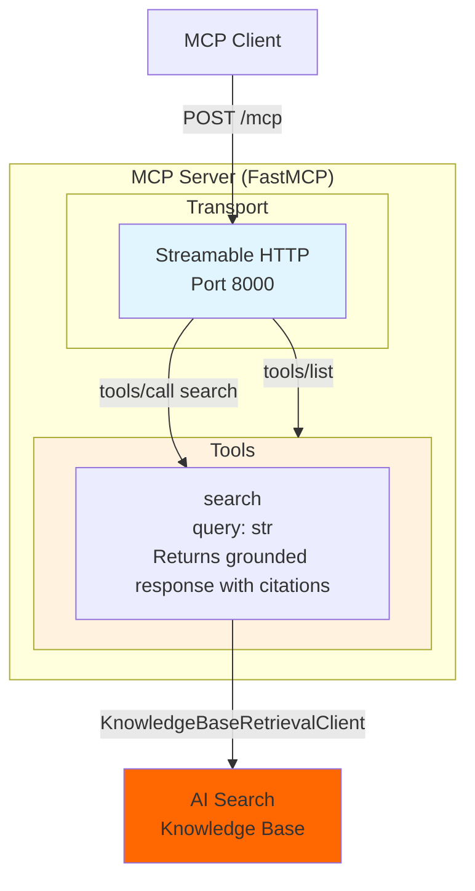

# Architecture Diagrams

This folder contains architecture diagrams for the MCP Server AI Search project.

---

## High-Level Architecture



---

## Azure Resource Architecture



---

## Data Flow - Agentic Retrieval



---

## Document Ingestion Pipeline



### Deployment Flow

```
azd up
├── 1. azd provision (Bicep)
│   ├── Search Service (semantic ranker: standard)
│   ├── Azure OpenAI (text-embedding-3-small, gpt-4o)
│   ├── Blob Storage (documents container)
│   └── Container App
│
├── 2. postprovision hook (setup_search.py) ← AUTO
│   ├── Create Search Index
│   ├── Create Data Source (→ Blob)
│   ├── Create Skillset (chunking + embedding)
│   ├── Create Indexer
│   ├── Create Knowledge Source
│   └── Create Knowledge Base
│
└── 3. azd deploy (Docker)
    └── Deploy MCP Server
```

### After Deployment

1. **Upload documents** to Blob Storage container
2. **Indexer runs automatically** (or trigger manually)
3. **MCP Server uses Knowledge Base** for agentic retrieval

---

## Authentication Flow



---

## MCP Protocol Surfaces



### Current Implementation

| MCP Surface | Status | Details |
|-------------|--------|---------|
| **Tools** | ✅ Implemented | `search` - Agentic retrieval via Knowledge Base |
| **Resources** | 🔮 Future | Could expose `docs://` for document access |
| **Prompts** | 🔮 Future | Could add Q&A templates |

---

## Rendering Diagrams

These diagrams use [Mermaid](https://mermaid.js.org/) syntax and render automatically in:
- GitHub (README files, issues, PRs)
- VS Code (with Mermaid extension)
- Azure DevOps Wiki
- Notion, Confluence (with plugins)

To preview locally, install the VS Code extension:
```
ext install bierner.markdown-mermaid
```
